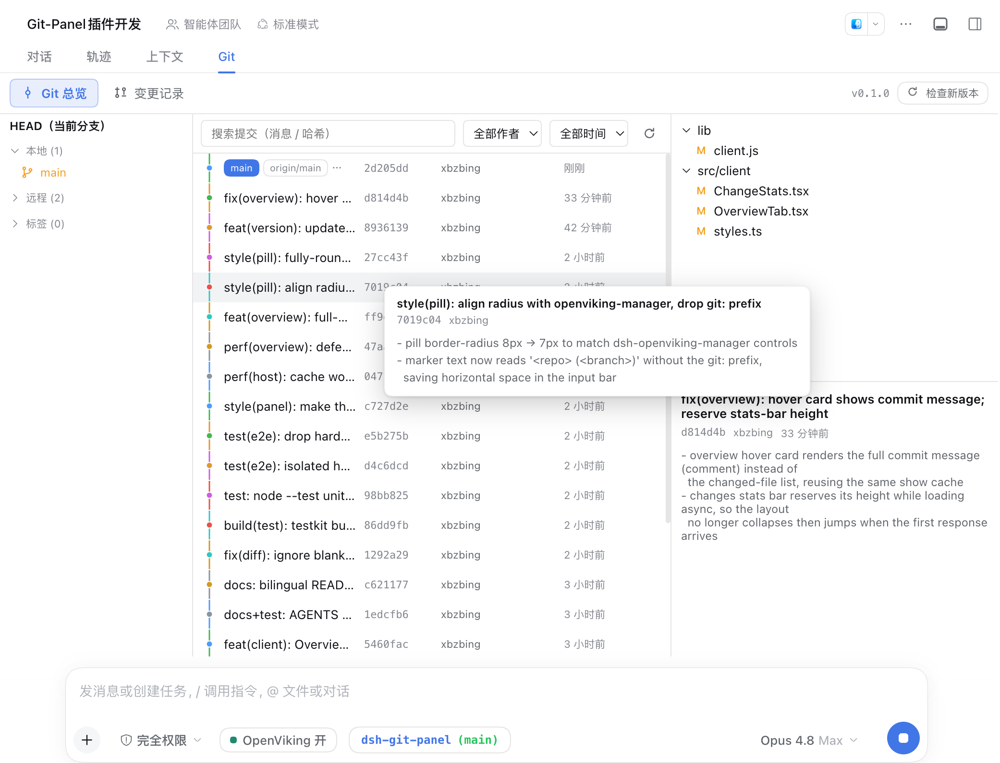
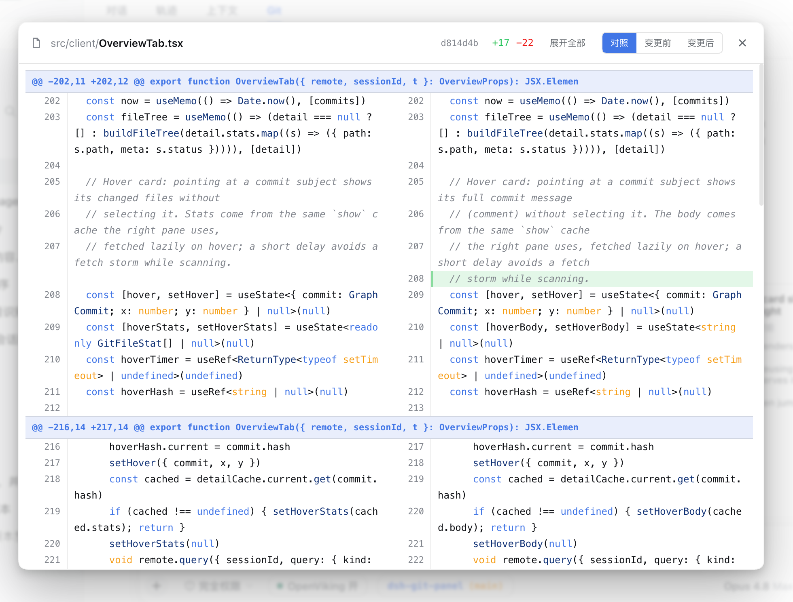
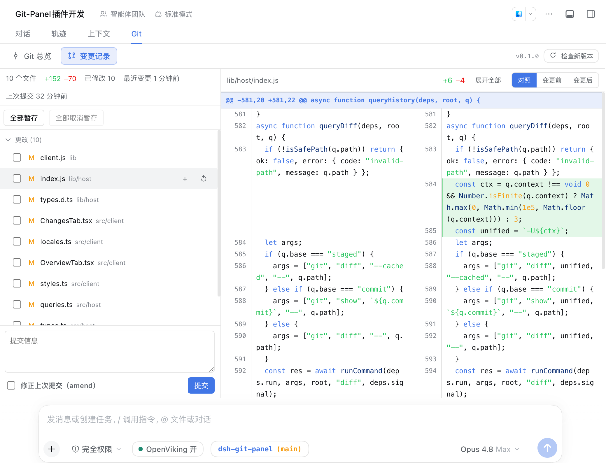

# dsh-git-panel

[English](README_EN.md) | 简体中文

`dsh-git-panel` 是一个 DSH Web GUI 插件，在对话工作区里提供 IDE 风格的 Git 面板。它把分支列表、提交历史图、未提交变更的提交与 amend、语法高亮的差异对照集中到一个常驻标签页，并在输入框左侧放一个 zsh 风格的分支标记，让你在对话过程中随手查看仓库状态、提交改动，不必切到终端或另开 IDE。

面板只读取当前会话工作目录所在的 Git 仓库，所有 git 命令都以 argv 数组经宿主的 subprocess 服务执行，不拼接 shell 字符串，工作目录锁定在仓库根，并带超时与输出上限。插件不改动 git 配置，写操作（提交、amend、暂存、丢弃）都有明确入口。

## 安装

```bash
# 从 GitHub 仓库安装（仓库已提交构建产物，无需本地构建）
dsh plugin add github:xbzbing/dsh-git-panel
```

安装后重启或刷新 Web GUI，工作区标签栏（「对话」「轨迹」之后）就会出现 **Git** 面板。也可以把插件加入 dsh web profile 的 `dsh.profile.bundles`，用 `file:` 依赖指向本目录，再 `node build.mjs` 构建后从本地源码安装。

## 功能

- **Git 总览**：三栏布局。左栏是分支 / 标签列表，点击某个引用即按它过滤历史；中栏是提交历史图，支持按提交信息、commit 哈希、作者、日期搜索，悬停某条提交弹出卡片显示完整提交信息（comment）；右栏是选中提交的变更文件树与提交信息，点击文件在弹出的 modal 里查看该文件在此提交中的差异。
- **变更记录**：面向本地工作区。左栏是统计条（文件数 / 增删行数 / 最近变更时间）、带复选框的未提交变更列表、以及含 **Amend** 复选框的提交框，支持逐文件暂存 / 取消暂存 / 丢弃与手动提交；右栏是选中文件的 side-by-side 差异对照。
- **语法高亮差异**：两处差异视图（总览 modal 与变更记录）都带懒加载的 highlight.js 语法高亮，按文件扩展名选择语法，高亮首次查看 diff 时才动态加载。
- **展开未变更行**：差异工具栏提供「展开全部 / 折叠未变更」切换，展开后显示整个文件而不只是变更附近的上下文。
- **对照模式**：差异支持「对照 / 变更前 / 变更后」三种视图切换。
- **输入框 Git 标记**：一个 zsh 主题风格的 `<仓库名> (<分支>)` 标记，仓库名青色，`(分支)` 在已同步时为绿色、有未提交变更时为橙色；悬停显示完整仓库路径，点击跳转面板（有未提交变更进入变更记录，否则进入 Git 总览）；当前目录不是 Git 仓库时只显示目录名，不报错。
- **版本与仓库入口**：子标签行右侧显示插件版本号，旁边有「检查新版本」按钮（用户主动点击才比对 GitHub 最新发布）和一个跳转到 GitHub 仓库的图标。
- UI 跟随 DSH 系统语言设置，支持简体中文和英文。

## 界面

| Git 总览 | 文件差异 modal |
| :---: | :---: |
|  |  |
| 变更记录 | 插件详情 |
|  |  |

## 架构

插件分 host / client 两半，通过 typert Remote 网关通信。

- **Host**（`lib/host/`）：`gitPanel` 命名空间上的 Cordis + typert `GitPanelService`，暴露 `snapshot` / `run` / `query` / `version` 四个端点，仅做端点委托与生命周期接线；git 命令经宿主 `subprocess` 服务执行（argv 数组、无 shell、cwd 锁仓库根、超时 + 输出上限）。
- **Client**（`lib/client.js`）：一个 React 包，注册 `conversation.view` 面板和 `conversation.input.left` 标记。每会话一个快照控制器（轮询 + turn 完成后刷新 + 连接重置重拉），标记、变更记录页和统计条共用同一份快照，避免重复 git 命令。

## 开发

```bash
node build.mjs      # tsc（host d.ts）+ esbuild（host bundle + client bundle + testkit）
npm run typecheck   # 类型检查
npm run test:unit   # 纯算法与 host 端点单测（node --test）
npm run test:e2e    # 隔离的 file:// 无头浏览器 e2e（不碰任何运行中的实例）
npm test            # 单测 + e2e
```

host bundle 不做压缩：typert 网关靠方法参数名做参数校验，压缩会改名并破坏 wire 契约。client 改动没有热重载，需重新构建并刷新页面。`lib/` 作为构建产物随 git 提交入库，改动 `src/` 后必须重新构建并提交，否则从 GitHub 安装会加载到过期入口；测试期生成的 `lib/testkit.mjs` 不入库。

## 项目结构

```text
src/
  host/
    types.ts        wire 数据模型的唯一权威源（client 直接复用）
    index.ts        GitPanelService：端点委托与生命周期接线
    git.ts          subprocess → 带超时的 GitRunner
    core.ts         workspace 解析 + snapshotForSession
    actions.ts      GitAction → git 命令序列（commit / amend / stage 等）
    queries.ts      history / diff / show / branches / tags / worktree-stats
    parser.ts       git 输出解析为结构化数据
    version.ts      本包版本 + GitHub release 更新检查
  client/
    rpc.ts          gitPanel 端点的 client 面
    controller.ts   每会话快照控制器
    Panel.tsx       主面板壳：子 tab 路由 + 版本条
    OverviewTab.tsx Git 总览三栏 + hover 卡片
    ChangesTab.tsx  变更记录页
    DiffView.tsx    并排差异视图
    GitPill.tsx     输入框标记
    highlight.ts    diff 语法高亮的懒加载门面
    git-graph.ts / file-tree.ts / diff.ts   自研纯算法
```

## 许可证

本项目采用 [MIT License](LICENSE)。
