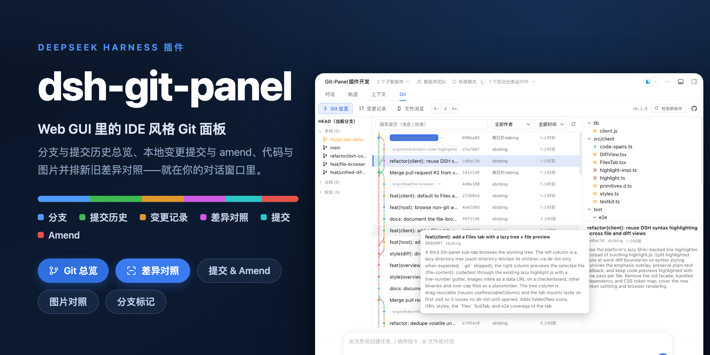
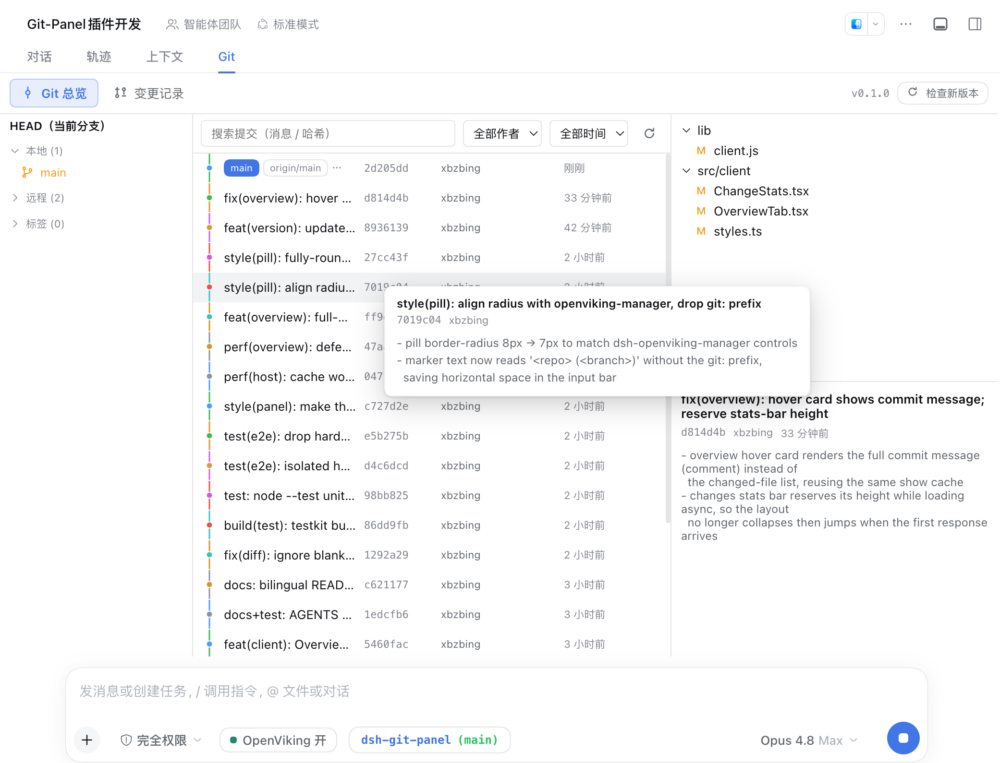
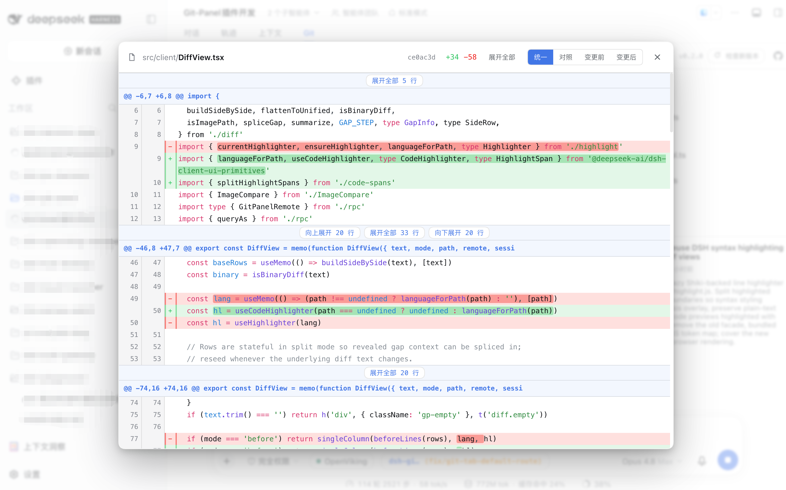
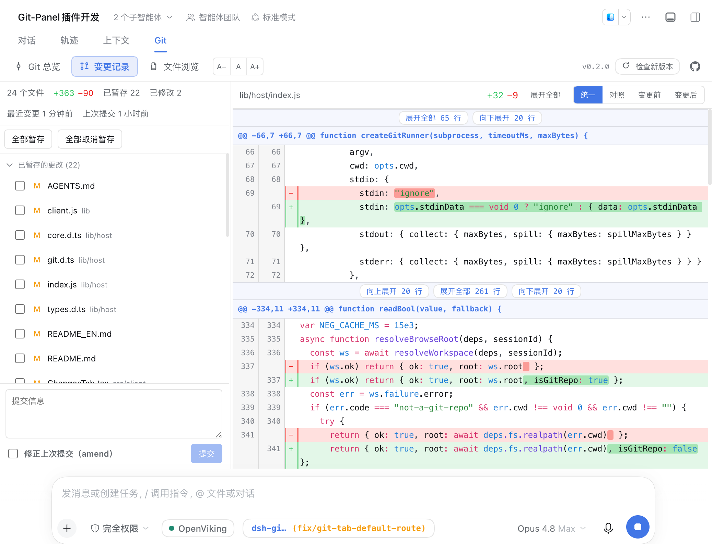
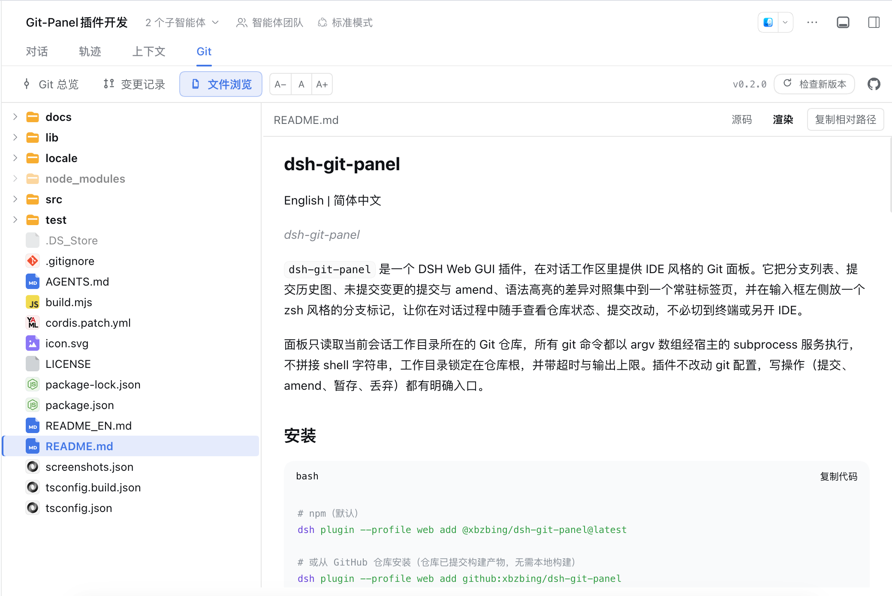

# dsh-git-panel

[English](README_EN.md) | 简体中文



`dsh-git-panel` 是一个 DSH Web GUI 插件，在对话工作区里提供 IDE 风格的 Git 面板。它把分支列表、提交历史图、未提交变更的提交与 amend、语法高亮的差异对照集中到一个常驻标签页，并在输入框左侧放一个 zsh 风格的分支标记，让你在对话过程中随手查看仓库状态、提交改动，不必切到终端或另开 IDE。

面板只读取当前会话工作目录所在的 Git 仓库，所有 git 命令都以 argv 数组经宿主的 subprocess 服务执行，不拼接 shell 字符串，工作目录锁定在仓库根，并带超时与输出上限。插件不改动 git 配置，写操作（提交、amend、暂存、丢弃）都有明确入口。

## 安装

```bash
# npm（默认）
dsh plugin --profile web add @xbzbing/dsh-git-panel@latest

# 或从 GitHub 仓库安装（仓库已提交构建产物，无需本地构建）
dsh plugin --profile web add github:xbzbing/dsh-git-panel
```

安装或更新后，重启 `dsh web` 服务再刷新页面，工作区标签栏（「对话」「轨迹」之后）就会出现 **Git** 面板。插件分 host 与 client 两半，宿主挂载和 client bundle 清单都在服务启动时定型，因此代码更新（安装、`add` 覆盖 `lib`）通常需要重启服务，仅刷新页面可能看不到变化。面板内的配置项（详情页的输入框标记开关、差异默认视图）走配置热写，改动即时生效、无需重启。

> **兼容性**：已在 `dsh@0.2.1-alpha.1` 上实测，安装、Git 面板、输入框标记与 host RPC 均可正常使用。

## 功能

- **Git 总览**：三栏布局。左栏是分支 / 标签列表，点击某个引用即按它过滤历史；中栏是提交历史图，支持按提交信息、commit 哈希、作者、日期搜索，悬停某条提交弹出卡片显示完整提交信息（comment）；右栏是选中提交的变更文件树与提交信息，点击文件在弹出的 modal 里查看该文件在此提交中的差异。
- **变更记录**：面向本地工作区。左栏是统计条（文件数 / 增删行数 / 最近变更时间）、带复选框的未提交变更列表、以及含 **Amend** 复选框的提交框，支持逐文件暂存 / 取消暂存 / 丢弃与手动提交；右栏是选中文件的差异对照。
- **AI 生成提交信息**：提交框旁的「AI 生成」按钮根据当前未提交变更（勾选了文件则只看这些文件）与最近一次提交的风格，调用你在 DSH 中配置的模型生成提交信息，填入提交框后可编辑再提交；没有可生成的变更、模型服务不可用或生成失败都会给出明确提示。**隐私提示：生成请求会把 diff 内容发送给你在 DSH 中所配置模型的供应商。** 可在插件详情页关闭该按钮。
- **标签管理**：在「Git 总览」右栏的提交详情顶部可为选中的提交创建标签（轻量标签，或带说明的附注标签）；该提交上已有的标签以可删除的标签片呈现，删除走二次确认。创建与删除标签都只作用于本地仓库，不会推送到远程，如需同步需自行 `git push <remote> <tagname>`（或 `--tags`）。
- **提交回撤**：同一处提交操作区可「还原此提交」（revert，追加一个反向提交、不动工作区）或「重置到此」（reset，软 / 混合 / 硬三挡）。硬重置会列出将被永久丢弃的未提交改动并要求额外勾选确认，始终不作为默认方式；检测到未提交改动时提示这些改动可能是 dsh AI 正在进行的工作。还原与重置都只改写本地仓库，不会推送到远程，远端分支需你自行推送同步。
- **贮藏（stash）**：「变更记录」页可将当前未提交更改贮藏起来（可填说明），下方的贮藏列表支持应用 / 弹出 / 丢弃；弹出或应用遇到冲突时保留贮藏条目并提示，不会半途丢失。丢弃走二次确认。
- **共享工作区护栏**：标签 / 贮藏 / 还原 / 重置等写操作与 dsh 的 AI 共用同一仓库，弹窗底部统一提示「可直接让 AI 执行 Git 操作」；撞上 `.git/index.lock`（另一进程正在操作）会自动重试一次并给出「Git 正忙」提示而非原始报错。
- **文件浏览**：直接打开工作区「Git」标签时，非 Git 目录默认进入文件浏览；Git 仓库中无未提交变更则进入「Git 总览」，有未提交变更则进入「变更记录」。非 Git 目录也能浏览，以当前工作目录为根。左栏目录树按需加载（点开才读取下一层，不显示 `.git`），按文件类型显示 dsh 官方图标，被 `.gitignore` 忽略的条目半透明呈现，宽度可拖动；右栏可预览代码、文本和图片，顶部可复制文件相对路径，过大文件或其他二进制文件显示提示。Markdown 默认显示源码，可点击「渲染」切换到 dsh 自带的 Markdown 视图；HTML 默认显示源码，可点击「渲染」在隔离沙箱（`allow-scripts`、无同源权限）中预览页面，不会自动执行。大文件的源码视图按行虚拟化（只渲染视口内的行），超大文件关闭语法高亮、超长行截断，保证流畅。
- **代码内查找**：文件浏览的源码视图与差异对照都支持 <kbd>Ctrl</kbd>/<kbd>⌘</kbd>+<kbd>F</kbd> 就地查找——高亮全部命中并保留语法着色，显示「当前 / 总数」，<kbd>Enter</kbd> / <kbd>Shift</kbd>+<kbd>Enter</kbd> 或 `‹` `›` 在命中间跳转，可切换区分大小写（默认不敏感），<kbd>Esc</kbd> 关闭。命中统计覆盖整份内容，视口外的命中同样计入并可跳转。
- **语法高亮差异**：总览弹窗、变更记录和文件浏览共用 dsh 官方语法高亮，按文件扩展名选择语言，语法资源按需加载；差异视图的改动词级强调保留原有交互。
- **对照模式**：差异支持「统一 / 对照 / 变更前 / 变更后」四种视图切换。统一视图为单栏行内对比（改动行前后紧邻，省横向空间），对照视图为左右并排；两种视图都带块间隐藏上下文的按需展开与改动行的词级高亮。默认视图可在插件详情页选择（统一 / 并排），也可在每个差异视图工具栏临时切换。
- **移动端 / 窄面板自适应**：面板宽度收窄到 620px 及以下（手机竖屏，或右侧栏挤压面板）时自动切换为单栏「钻取」布局——三栏折叠为一栏，列表与详情 / 差异 / 预览之间点击进入、带「返回」按钮退出；Git 总览的分支筛选改为从底部升起的面板（bottom sheet），提交行改为两行式更易点按，顶栏控件换行到第二行而非隐藏，差异对比在窄屏隐藏「对照」（并排）模式。面板变宽后自动恢复三栏布局，桌面体验不变。触控设备（如平板）上逐文件操作按钮常驻显示、点按区域放大。
- **显示输入框标记开关**：插件详情页可切换输入框标记；关闭后输入框不再显示分支标记，改为在「Git」标签旁显示状态圆点（绿=已同步、橙色=有变更），两者互斥，保存后立即生效。同一处配置区还可设置差异对比的默认视图（统一 / 并排）、提交历史图的线条样式（平行线 VSCode 风格 / 紧凑 git log 风格，默认平行线）以及是否在提交框显示「AI 生成」按钮。
- **输入框 Git 标记**：一个 zsh 主题风格的 `<仓库名> (<分支>)` 标记，仓库名青色，`(分支)` 在已同步时为绿色、有未提交变更时为橙色；悬停显示完整仓库路径，点击跳转面板（有未提交变更进入变更记录，否则进入 Git 总览）；非 Git 目录不显示输入框标记，可通过工作区的「Git」标签进入文件浏览。
- UI 跟随 DSH 系统语言设置，支持简体中文和英文。

## 界面

| Git 总览 | 文件差异 modal |
| :---: | :---: |
|  |  |
| 变更记录 | 文件浏览 |
|  |  |

## 架构

插件分 host / client 两半，通过 typert Remote 网关通信。

- **Host**（`lib/host/`）：`gitPanel` 命名空间上的 Cordis + typert `GitPanelService`，暴露 `snapshot` / `run` / `query` / `suggest` / `version` 五个端点，仅做端点委托与生命周期接线；git 命令经宿主 `subprocess` 服务执行（argv 数组、无 shell、cwd 锁仓库根、超时 + 输出上限）；`suggest` 端点经宿主 `llm` 服务用你已配置的模型一次性生成提交信息。
- **Client**（`lib/client.js`）：一个 React 包，注册 `conversation.view` 面板和 `conversation.input.left` 标记。每会话一个快照控制器（轮询 + turn 完成后刷新 + 连接重置重拉），标记、变更记录页和统计条共用同一份快照，避免重复 git 命令。

## 开发

```bash
node build.mjs      # tsc（host d.ts）+ esbuild（host bundle + client bundle + testkit）
npm run typecheck   # 类型检查
npm run test:unit   # 纯算法与 host 端点单测（node --test）
npm run test:e2e    # 隔离的 file:// 无头浏览器 e2e（不碰任何运行中的实例）
npm test            # 单测 + e2e
```

host bundle 不做压缩：typert 网关靠方法参数名做参数校验，压缩会改名并破坏 wire 契约。client 改动没有热重载，需重新构建并刷新页面。`lib/` 作为构建产物随 git 提交入库，改动 `src/` 后必须重新构建并提交，否则从 GitHub 安装会加载到过期入口；测试期生成的 `lib/testkit.mjs` 不入库。本地联调：把插件加入 dsh web profile 的 `dsh.profile.bundles`，用 `file:` 依赖指向本目录，构建后即生效。

## 项目结构

```text
src/
  host/
    types.ts        wire 数据模型的唯一权威源（client 直接复用）
    index.ts        GitPanelService：端点委托与生命周期接线
    git.ts          subprocess → 带超时的 GitRunner
    core.ts         workspace 解析 + snapshotForSession
    actions.ts      GitAction → git 命令序列（commit / amend / stage 等）
    queries.ts      history / diff / file-lines / image-diff / dir-list / file-content / show / branches / tags / worktree-stats
    suggest.ts      AI 生成提交信息（diff 收集 + ctx.llm 一次性调用）
    parser.ts       git 输出解析为结构化数据
    version.ts      本包版本 + GitHub release 更新检查
  client/
    rpc.ts          gitPanel 端点的 client 面
    controller.ts   每会话快照控制器
    Panel.tsx       主面板壳：子 tab 路由 + 版本条
    OverviewTab.tsx Git 总览三栏 + hover 卡片
    ChangesTab.tsx  变更记录页
    FilesTab.tsx    文件浏览（懒加载目录树 + 文件预览）
    DiffView.tsx    差异视图（统一 / 并排 / 变更前 / 变更后）
    GitPill.tsx     输入框标记
    code-spans.ts   将语法高亮 token 按词级改动区间切分
    git-graph.ts    提交图车道布局
    file-tree.ts    路径折树
    diff.ts         unified diff → 并排行 + 统一行 + 统计
```

## 许可证

本项目采用 [MIT License](LICENSE)。
