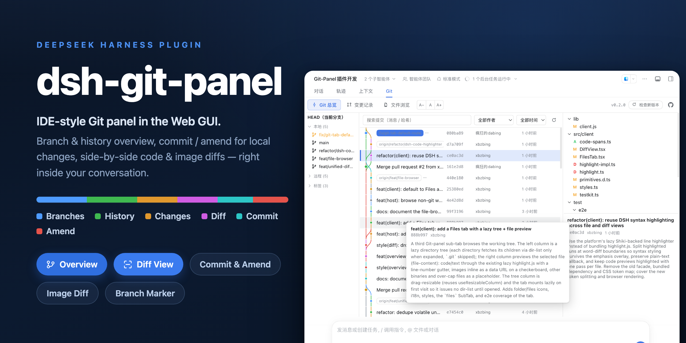

# dsh-git-panel

English | [简体中文](README.md)



`dsh-git-panel` is a DSH Web GUI plugin that brings an IDE-style Git panel into the conversation workspace. It gathers the branch list, commit history graph, uncommitted-change commit & amend, and syntax-highlighted diffs into one resident tab, and puts a zsh-style branch marker at the left of the input bar — so you can check repo status and commit changes mid-conversation without switching to a terminal or a separate IDE.

The panel only reads the Git repository at the current session's working directory. Every git command runs through the host subprocess service as an argv array — no shell string concatenation — with the working directory locked to the repository root and per-command timeout and output caps. The plugin never touches your git config, and every write (commit, amend, stage, discard) has an explicit entry point.

## Install

```bash
# npm (default)
dsh plugin --profile web add @xbzbing/dsh-git-panel@latest

# or from the GitHub repository (the built tree is committed, no local build needed)
dsh plugin --profile web add github:xbzbing/dsh-git-panel
```

Restart or refresh the Web GUI afterwards and the **Git** panel appears in the workspace tab bar (after Chat and Trajectory).

## Features

- **Overview** — three columns. The left column is the branch / tag list; clicking a ref filters history by it. The middle column is the commit history graph, searchable by commit message, commit hash, author, or date; hovering a commit shows a card with its full commit message (comment). The right column is the selected commit's changed-file tree and commit message; click a file to see its diff within that commit in a modal.
- **Changes** — the local working tree. The left column has a statistics bar (file count / added·deleted lines / last-change time), the uncommitted change list with per-file checkboxes, and a commit box with an **Amend** checkbox; per-file stage / unstage / discard and manual commit are supported. The right column is the selected file's diff.
- **Syntax-highlighted diffs** — both diff views (the overview modal and the changes page) render lazy-loaded highlight.js syntax highlighting, picking a grammar by file extension; the highlighter is dynamically imported only the first time a diff is viewed.
- **Expand unchanged lines** — the diff toolbar offers an "expand all / collapse unchanged" toggle; expanded, it shows the whole file instead of just the context around each change.
- **Diff modes** — unified / split / before / after views. Unified is a single inline column (each change shown as adjacent `-`/`+` lines, saving horizontal space); split is side-by-side. Both carry on-demand expansion of hidden between-hunk context and word-level emphasis on changed lines. The default view is selectable on the plugin detail page (unified / split) and can be switched per diff from the toolbar.
- **Image compare** — diffs of image files (png, jpg, …) skip the binary placeholder and render "before / after" panes side by side (in both the overview modal and the changes page); an added or deleted image shows "Does not exist" on the other pane.
- **Show input-bar marker toggle** — the plugin detail page can toggle the input-bar marker; when off, the input bar stays clean and the Git tab shows a status dot instead (green = synced, orange = dirty). The two are mutually exclusive and changes apply immediately. The same config section also sets the default diff view (unified / split).
- **Input-bar Git marker** — a zsh-theme `<repo> (<branch>)` marker: the repo name is cyan, `(branch)` is green when in sync and orange when there are uncommitted changes; hover shows the full repository path, and clicking jumps to the panel (to Changes when dirty, otherwise to Overview); when the current directory is not a Git repository, it shows only the directory name, with no error text.
- **Version & repo entry** — the sub-tab row shows the plugin version on the right, next to a "Check for updates" button (queries GitHub for the latest release only when clicked) and an icon linking to the GitHub repository.
- The UI follows the DSH system language, in Simplified Chinese and English.

## Screenshots

| Overview | File-diff modal |
| :---: | :---: |
|  |  |
| Changes | |
|  | |

## Architecture

Two halves communicating over the typert Remote gateway.

- **Host** (`lib/host/`) — a Cordis + typert `GitPanelService` on the `gitPanel` namespace, exposing `snapshot` / `run` / `query` / `version` and doing only endpoint delegation and lifecycle wiring; git runs through the host `subprocess` service (argv arrays, no shell, cwd locked to the repository root, timeout + output caps).
- **Client** (`lib/client.js`) — a React bundle that registers the `conversation.view` panel and the `conversation.input.left` marker. One snapshot controller per session (polling + a refresh after each turn + a reload on connection reset) feeds the marker, the changes page, and the stats bar from a single snapshot, avoiding duplicate git commands.

## Development

```bash
node build.mjs      # tsc (host d.ts) + esbuild (host bundle + client bundle + testkit)
npm run typecheck   # type check
npm run test:unit   # pure-algorithm and host-endpoint unit tests (node --test)
npm run test:e2e    # isolated file:// headless-browser e2e (never touches a running instance)
npm test            # unit + e2e
```

The host bundle is not minified: the typert gateway validates arguments by method parameter name, and minification would rename them and break the wire contract. Client changes are not hot-reloaded — rebuild and refresh the page. `lib/` is committed as a build artifact so `dsh plugin add github:…` installs the built tree directly; after editing `src/` you must rebuild and commit, or a GitHub install loads a stale entry. The test-time `lib/testkit.mjs` is not committed. For local development, add the plugin to a dsh web profile's `dsh.profile.bundles` with a `file:` dependency pointing at this directory; a rebuild makes it effective.

## Project structure

```text
src/
  host/
    types.ts        the single source of truth for the wire data model (reused by the client)
    index.ts        GitPanelService: endpoint delegation + lifecycle wiring
    git.ts          subprocess → a GitRunner with timeouts
    core.ts         workspace resolution + snapshotForSession
    actions.ts      GitAction → git command sequences (commit / amend / stage …)
    queries.ts      history / diff / image-diff / show / branches / tags / worktree-stats
    parser.ts       git output parsed into structured data
    version.ts      package version + GitHub release update check
  client/
    rpc.ts          the client face of the gitPanel endpoints
    controller.ts   per-session snapshot controller
    Panel.tsx       panel shell: sub-tab routing + version bar
    OverviewTab.tsx Overview three columns + hover card
    ChangesTab.tsx  changes page
    DiffView.tsx    diff view (unified / split / before / after)
    GitPill.tsx     input-bar marker
    highlight.ts    lazy-loading facade for diff syntax highlighting
    git-graph.ts    commit-graph lane layout
    file-tree.ts    file paths folded into a tree
    diff.ts         unified diff → side-by-side rows + inline rows + stats
```

## License

[MIT License](LICENSE).
